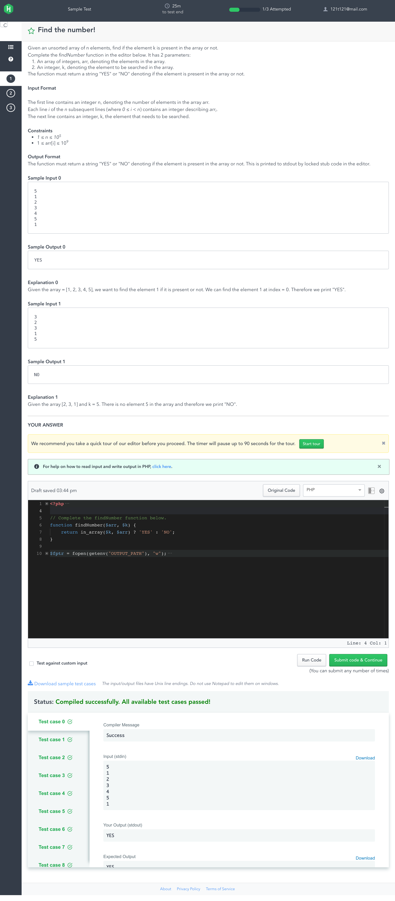

# HackerRank coding tests

[<- Go back](../README.md)

- [sample test HR with wrapper](sample.php)

- [initial testing sample](initial-testing.php)

    

task description - Find the number

     
    

    
    

task description - Odd numbers

     
    

- [hackerrank test examples](hackerrank/hackerrank.php)

    

sample test HR with wrapper

     
    

