# HackerRank coding tests

[<- Go back](../README.md)

### PHP

- [sample test HR with wrapper](php/sample.php)

- [initial testing sample](php/initial-testing.php)

    

task description - Find the number

     
    

    
    

task description - Odd numbers

     
    

- [Warm-up Challenges](php/warm-up-challenges.php)

    

task description - Sock merchant

    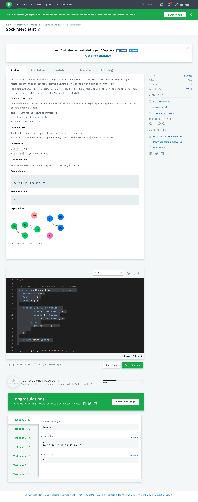 
    

    
    

task description - Counting valleys

    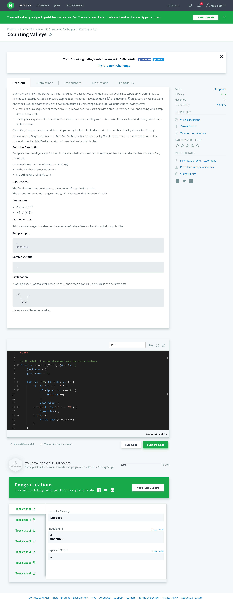 
    

    

task description - Jumping on the clouds

    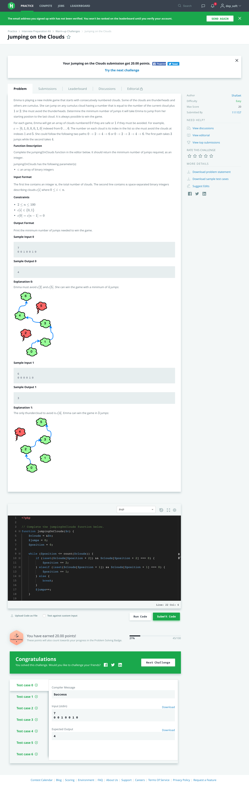 
    

    

task description - Repeated string

    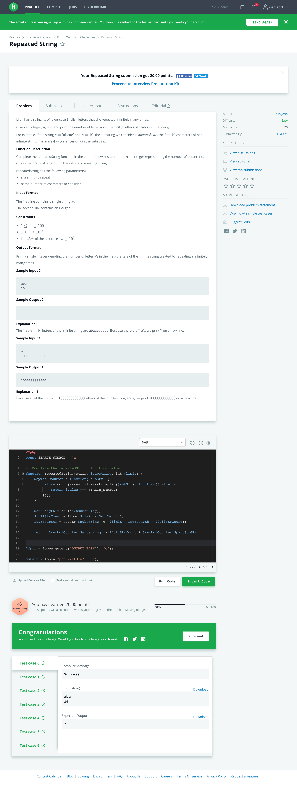 
    

    
- [Arrays](php/arrays.php)

    

task description - 2D array

    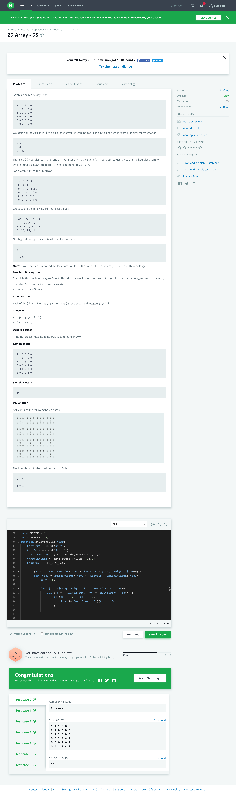 
    

    
    

task description - Array left rotation

    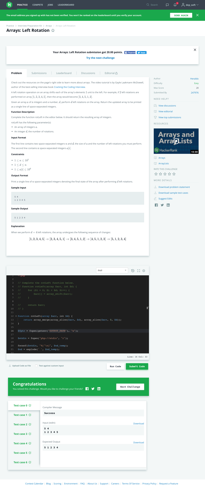 
    

    

task description - New Year chaos

    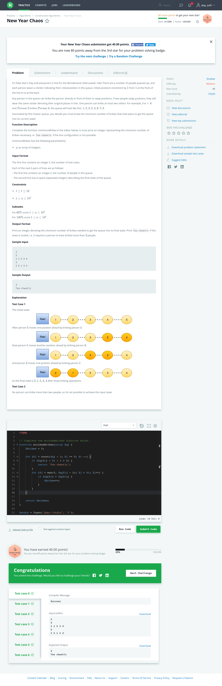 
    

- [Dictionaries and Hashmaps](php/dictionaries-and-hashmaps.php)

    

task description - Ransom note

    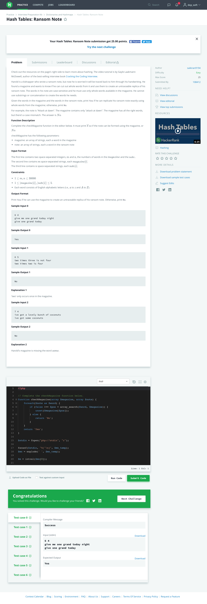 
    

    
    

task description - Two strings

    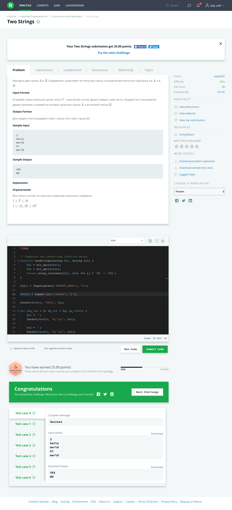 
    

- [Sorting](php/sorting.php)

    

task description - Bubble sort

    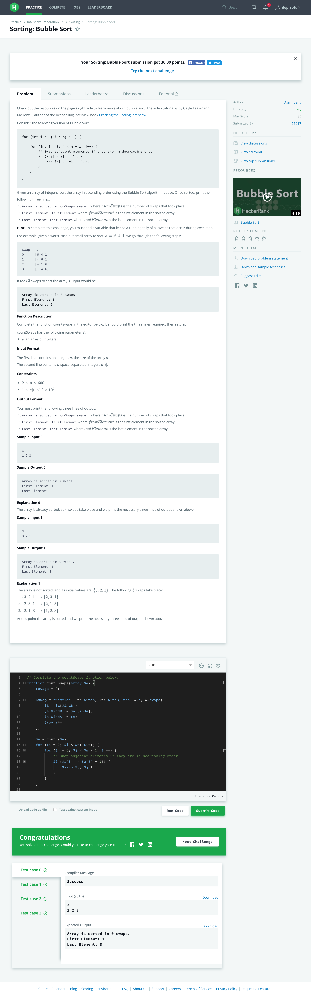 
    

    
    

task description - Mark and toys

    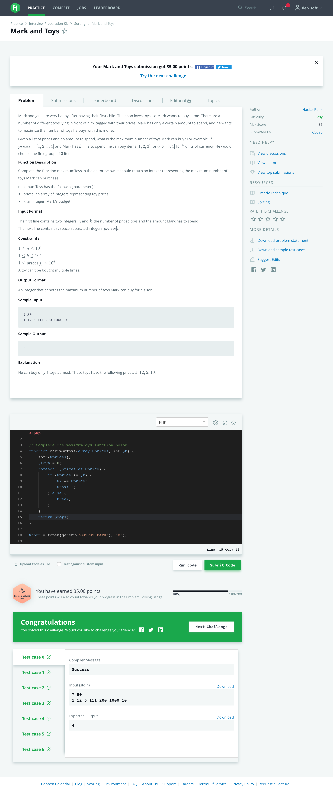 
    

- [Strings](php/strings.php)

    

task description - Making anagrams

    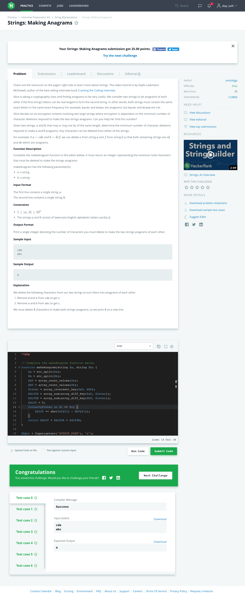 
    

    
    

task description - Sherlock and anagrams

    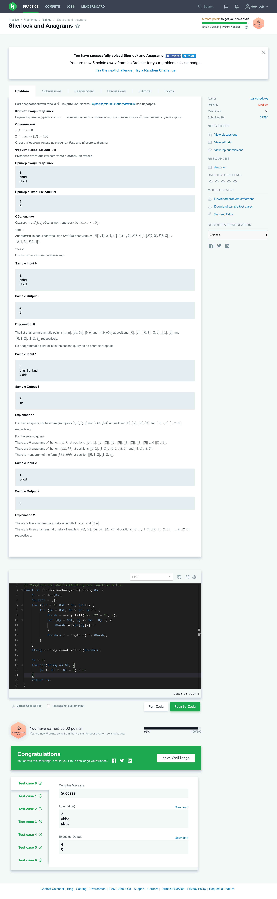 
    

- [Algorithms](php/algorithms.php)

    

task description - Minimum absolute difference in an array

    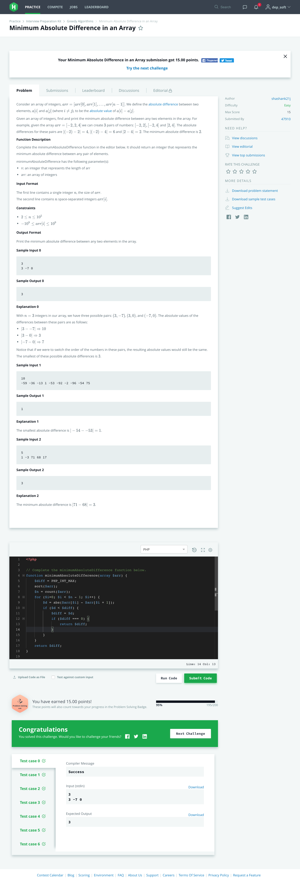 
    

- [Search](php/search.php)

    

task description - Ice cream Parlor

    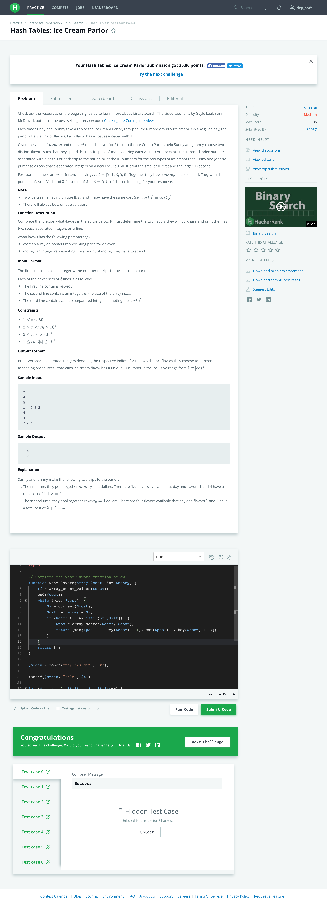 
    

### SQL

task description - Revising the select query

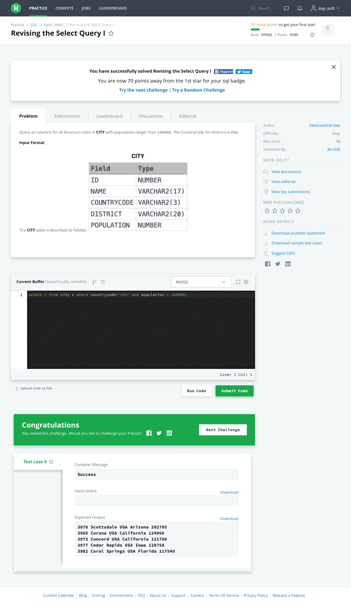 

task description - Revising the select query 2

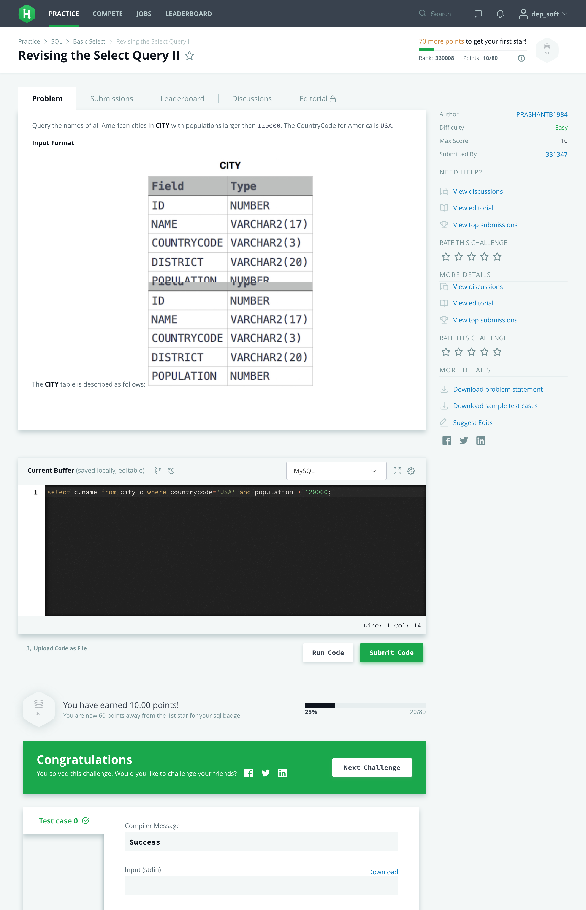 

task description - Select all

 

task description - Whether observation station

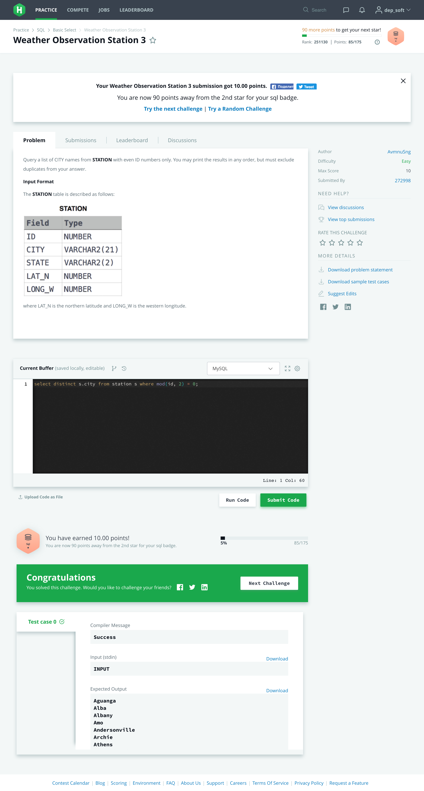 

